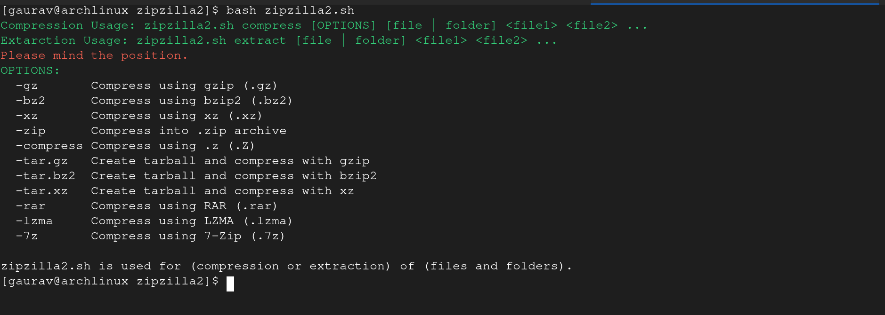
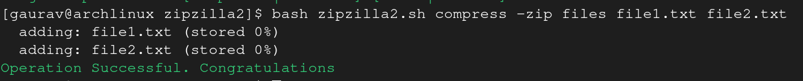
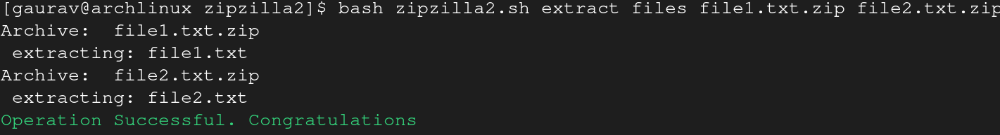

# zipzilla2

**zipzilla2** is a silent, command-line tool for compressing and extracting files and folders on all Linux distributions.

**Understand what it says**

e.g.:

    ./zipzilla2 compress -zip folder folder_name ...


zipzilla    compress_kr     -zip_me     in_folders_ko    folder_name ...


## Screenshots

- **zipzilla usage**
  
- **zipzilla usage for compression**
  
- **zipzilla usage for extraction**
  

## 📖 Usage

## 🚀 Quick Start

1. Clone the repository:

```bash
git clone https://github.com/mahajang214/zipzilla2.git
cd zipzilla2
```

2. Make the script executable:

```bash
chmod +x zipzilla2
```

3. Run Zipzilla:

```bash
./zipzilla2 compress -zip folder images
```


### Basic Commands

```bash
# Compress files
./zipzilla2.sh compress -zip files file1.txt file2.txt

# Compress folders
./zipzilla2.sh compress -zip folders folder1 folder2

# Extract files
./zipzilla2.sh extract files file1.txt.zip file2.txt.zip


# Extract folders
./zipzilla2.sh extract folders folder1 folder2

```

## Features

- **Silent operation:** Minimal output, only success or error messages.
- **Supports multiple files and folders:** Compress or extract several items in a single command.
- **Wide range of formats supported:**
  - **Wide range of formats supported:**

| Format      | Extension(s) | Type             | Description                                   |
| ----------- | ------------ | ---------------- | --------------------------------------------- |
| Gzip        | `.gz`        | Compress/Extract | GNU zip compression (single file)             |
| Bzip2       | `.bz2`       | Compress/Extract | Burrows–Wheeler compression (single file)     |
| XZ          | `.xz`        | Compress/Extract | LZMA2 compression (single file)               |
| Zip         | `.zip`       | Compress/Extract | Standard ZIP archive (multiple files/folders) |
| Compress    | `.Z`         | Compress/Extract | Unix compress utility (older, single file)    |
| Tar + Gzip  | `.tar.gz`    | Compress/Extract | Tarball archive compressed with gzip          |
| Tar + Bzip2 | `.tar.bz2`   | Compress/Extract | Tarball archive compressed with bzip2         |
| Tar + XZ    | `.tar.xz`    | Compress/Extract | Tarball archive compressed with xz            |
| RAR         | `.rar`       | Compress/Extract | RAR archive (multiple files/folders)          |
| LZMA        | `.lzma`      | Compress/Extract | Lempel–Ziv–Markov chain compression           |
| 7-Zip       | `.7z`        | Compress/Extract | 7-Zip archive format                          |

- Extraction: All above formats
- **Automatic dependency installation:** Detects your Linux package manager and installs required tools if missing.
- **Works on all Linux distros:**

| Distribution Family | Supported Package Managers |
| ------------------- | -------------------------- |
| Debian/Ubuntu       | `apt`                      |
| Arch Linux          | `pacman`                   |
| Fedora/RHEL/CentOS  | `dnf`, `yum`               |
| openSUSE            | `zypper`                   |
| Alpine              | `apk`                      |
| NixOS               | `nix-env`                  |
